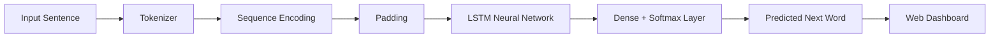

<div align="center">

# Neural Language Engine

**AI-powered next-word prediction system using LSTM neural networks for real-time language modeling and intelligent text completion.**

[](https://python.org)
[](https://tensorflow.org)
[](https://keras.io)
[](https://flask.palletsprojects.com)

</div>

---

# Overview

**Neural Language Engine** is an end-to-end **Natural Language Processing (NLP)** application that predicts the most probable next word using a deep learning model based on **Long Short-Term Memory (LSTM)** networks.

The system processes input text, converts it into numerical sequences using tokenization, performs inference with a trained LSTM model, and returns the most likely next word along with confidence scores and ranked predictions through an interactive web interface.

---

# Features

| Feature | Description |
|----------|-------------|
| **Next Word Prediction** | Predicts the most probable next word from an input sequence. |
| **LSTM Neural Network** | Deep learning model for sequential language modeling. |
| **Real-Time Inference** | Generates predictions instantly through a web interface. |
| **Confidence Scores** | Displays prediction probabilities for better interpretability. |
| **Top-5 Predictions** | Shows the five most likely next words with confidence values. |
| **Interactive Dashboard** | Modern UI with neural network visualization and responsive design. |

---

# Architecture



---

# Tech Stack

| Category | Technologies |
|----------|--------------|
| Language | Python |
| Deep Learning | TensorFlow, Keras |
| NLP | Tokenizer, Sequence Encoding |
| Model | LSTM |
| Backend | Flask |
| Frontend | HTML5, CSS3, JavaScript |
| Animations | GSAP, Vanta.js, SVG |

---

# Project Structure

```text
Neural-Language-Engine/
│
├── app.py
├── requirements.txt
├── README.md
│
├── models/
│   ├── lstm_model.h5
│   ├── tokenizer.pkl
│   └── max_len.pkl
│
├── templates/
│   └── index.html
│
├── static/
│   ├── style.css
│   ├── script.js
│   └── assets/
```

---

# Quick Start

## Prerequisites

- Python 3.10+
- TensorFlow
- Flask

---

## Installation

Clone the repository

```bash
git clone https://github.com/YOUR_USERNAME/Neural-Language-Engine.git

cd Neural-Language-Engine
```

Install dependencies

```bash
pip install -r requirements.txt
```

---

## Run

```bash
python app.py
```

Open

```
http://127.0.0.1:5000
```

---

# Prediction Pipeline

```text
Input Sentence
        │
        ▼
Tokenization
        │
        ▼
Sequence Encoding
        │
        ▼
Padding
        │
        ▼
LSTM Model
        │
        ▼
Softmax Probability
        │
        ▼
Top-5 Predictions
        │
        ▼
Predicted Next Word
```

---

# Model Workflow

1. User enters a sentence.
2. The tokenizer converts words into integer sequences.
3. Sequences are padded to the required input length.
4. The trained LSTM model processes the sequence.
5. A Softmax layer computes probability scores.
6. The highest-probability word is returned along with the Top-5 predictions.

---

# Applications

- AI Writing Assistants
- Smart Keyboard Suggestions
- Text Auto-Completion
- Chatbots
- Language Modeling
- Educational NLP Applications
- Content Generation Systems

---

# Future Improvements

- Transformer-based language models
- BERT/GPT integration
- Beam Search decoding
- Multi-language support
- REST API deployment
- Docker support
- Hugging Face integration
- ONNX optimization

---

# License

This project is intended for educational and research purposes.

---

<div align="center">

<sub>Built using Python, TensorFlow, Keras, LSTM Networks, Flask, and Natural Language Processing.</sub>

</div>
