# 🧠 Neural Language Engine
<div align="center">
### Deep Learning Powered Next Word Prediction System
  # 🧠 NEURAL LANGUAGE ENGINE
An interactive, end-to-end natural language processing (NLP) application that predicts the most probable next word in real-time. Features a high-fidelity dashboard built with glassmorphism aesthetics, an animated neural network simulation, and live confidence scores.
  ### *Deep Learning Powered Next Word Prediction System*
[](#)
[](#)
[](#)
  [](https://tensorflow.org)
  [](https://flask.palletsprojects.com)
  [](https://javascript.info)
  [](https://w3.org/Style/CSS)
---
  <p align="center">
    A premium, full-stack AI SaaS dashboard that predicts user text inputs in real-time. Designed with modern glassmorphism aesthetics, dynamic canvas-rendered neural network streams, and live confidence score metrics.
  </p>
## ⚡ Live Demo Preview
  **[🖥️ View Codebase](https://github.com/MaddipatlaChetan24/Neural-Language-Engine)** • **[📂 Slide Deck Presentation](./Neural_Language_Engine_Carousel.pdf)**
The system features a dual-panel layout:
*   **Workspace (Left)**: Real-time text area with auto-completion trigger and inference pipeline animation.
*   **Analytics Panel (Right)**: Model confidence gauge (radial progress) and top-5 word probability distribution bars.
*   **Neural Network Visualizer**: Interactive HTML5 canvas showing active neuron layers, connection weights, and sequential particle flows.
  <br>
  
  
</div>
---
## 🚀 Key Features
## ⚡ Core Features
*   **Real-Time Inference**: Predicts the next word as you type with low latency (<50ms).
*   **Confidence Scoring**: Displays model prediction confidence using a custom SVG gauge.
*   **Distribution Analysis**: Visualizes top-5 word probability distributions with staggered gradient bar graphs.
*   **Pipeline Visualizer**: Pulsing node flow showcasing step-by-step pipeline execution (Tokenization ➔ Padding ➔ LSTM ➔ Softmax).
*   **Interactive Simulation**: Visualizes data propagation between layers of artificial neurons using canvas particle animations.
*   **Real-time Inference (<50ms)**: Predicts the next word in real-time as you type, matching typical typing speeds.
*   **Confidence Scoring & Probability Gauges**: Visualizes the model's certainty with a radial SVG progress arc.
*   **Top-5 Word Distributions**: Displays alternative predictions with dynamic, staggered gradient probability bars.
*   **Sequential Pipeline Tracker**: An animated roadmap demonstrating how text propagates through the NLP stages.
*   **Canvas-rendered Neural Viz**: Simulates hidden layers, pulsing synapses, and feed-forward data propagation.
---
## 🛠️ Technology Stack
*   **Deep Learning & NLP**: Python, TensorFlow, Keras, LSTM sequence modeling, Pickle
*   **Backend API**: Flask / FastAPI
*   **Frontend UI/UX**: HTML5, CSS3 (Glassmorphism design system), JavaScript (ES6)
*   **Animations & Visuals**: GSAP (GreenSock Animation Platform), ScrollTrigger, Vanta.js NET (WebGL neural bg), HTML5 Canvas
<table align="center" style="width: 100%; border-collapse: collapse;">
  <tr>
    <td align="center" width="50%">
      <h3>🧠 AI & Backend Core</h3>
      <p>
        
        
        
        
      </p>
      <ul style="text-align: left;">
        <li><strong>Sequence Modeling</strong>: LSTM layer architecture capturing contextual dependencies.</li>
        <li><strong>Data Serialization</strong>: In-memory mapping buffers via Pickle serializer.</li>
      </ul>
    </td>
    <td align="center" width="50%">
      <h3>💻 UI & Interactions</h3>
      <p>
        
        
        
        
      </p>
      <ul style="text-align: left;">
        <li><strong>Styling</strong>: Glassmorphism backing, tricolor neon gradients.</li>
        <li><strong>Graphics</strong>: WebGL backdrop (Vanta) + HTML5 canvas neuron simulations.</li>
      </ul>
    </td>
  </tr>
</table>
---
## 📊 System Architecture
## 📊 Architecture & Workflow
```text
Input Text Prompt
       ↓
Tokenizer (Integer Word Mapping)
       ↓
Sequence Padding (Pre-Padding to match Max Sequence Length)
       ↓
LSTM Network (Context sequence processing)
       ↓
Dense Layer (Dimensionality expansion to Vocab Size)
       ↓
Softmax Layer (Probability distribution over vocabulary)
       ↓
Output Prediction (Argmax extraction for target next-word)

```mermaid
graph LR
    Input[Input Text] --> Tokenizer[Tokenizer Mapping]
    Tokenizer --> Padding[Sequence Pre-Padding]
    Padding --> LSTM[LSTM recurrent layer]
    LSTM --> Dense[Dense linear layer]
    Dense --> Softmax[Softmax normalization]
    Softmax --> Output[Predicted Next Word]
    
    style LSTM fill:#7B61FF,stroke:#FFFFFF,stroke-width:2px,color:#FFFFFF
    style Softmax fill:#00F5FF,stroke:#FFFFFF,stroke-width:2px,color:#050816
```

---
## ⚙️ Installation & Local Setup
## 🚀 Installation & Local Execution
### 1. Clone the Repository
### 1. Clone the repository
```bash
git clone https://github.com/MaddipatlaChetan24/Neural-Language-Engine.git
cd Neural-Language-Engine
```
### 2. Set Up a Virtual Environment
### 2. Set up virtual environment & install dependencies
```bash
python3 -m venv .venv
source .venv/bin/activate  # On Windows use: .venv\Scripts\activate
```
### 3. Install Dependencies
```bash
source .venv/bin/activate  # Windows: .venv\Scripts\activate
pip install -r requirements.txt
```
### 4. Run the Application
### 3. Launch Flask server
```bash
python app.py
```
Open **http://127.0.0.1:5000** in your browser to view the dashboard.
Open **http://127.0.0.1:5000** in your browser.
---
## 🧠 Model Training Details
## 🔍 Technical Deep-Dive
*   **Architecture**: Embedding Layer ➔ LSTM (150 Units) ➔ Dense (Softmax)
*   **Vocabulary Size**: 8,978 unique tokens
*   **Context Window**: Sequence length mapped dynamically using a pre-calculated padding sequence length (`max_len`).
*   **Artifacts Saved**: 
    *   `lstm_model.h5` — Trained network weights.
    *   `tokenizer.pkl` — Character/word mapping tokenization dictionary.
    *   `max_len.pkl` — Sequence padding index constraint.
<details>
<summary><b>🛠️ NLP Pipeline & Tokenizer Configuration (Click to Expand)</b></summary>
<br>
---
*   **Sequence Length Mapping**: Raw inputs are tokenized into numeric integers using a pre-saved index dictionary (`tokenizer.pkl`).
*   **Sequence Pre-Padding**: Sequences are zero-padded to match the constraint index (`max_len.pkl`) to guarantee constant input shape arrays.
*   **OOV (Out-Of-Vocabulary) Catching**: Custom fallback tokens (`<OOV>`) map unseen test-time words to context vectors, neutralizing input crash anomalies.
## 🚧 Engineering Challenges Resolved
</details>
*   **Handling Out-of-Vocabulary (OOV) Words**: Implemented fallback mapping within the tokenizer using an `<OOV>` token scheme to prevent vocabulary array index mismatches during real-time typing.
*   **Optimizing Latency**: Loaded model weights inside Flask's global runtime buffer on initialization, reducing prediction endpoint latencies to under 50ms.
<details>
<summary><b>📈 Model Structure Details (Click to Expand)</b></summary>
<br>
---
*   **Vocabulary Count**: Mapped over **8,978** unique tokens.
*   **Neural Topology**: Embedding Matrix ➔ LSTM Recurrent Layer (150 Units) ➔ Dense linear matrix projection ➔ Softmax class probabilities.
*   **Endpoint Optimization**: Weights and serialization dictionaries are preloaded directly in the global application memory pool during server init, decreasing endpoint computation times from >400ms to **under 50ms**.
## 🔮 Future Enhancements
</details>
*   **Transformer Migration**: Transition from LSTM to a self-attention based decoder architecture (similar to GPT-2) for long-range dependency modeling.
*   **Quantization**: Convert the model to TensorFlow Lite (TFLite) for lightweight edge deployments.
*   **Containerization**: Set up Docker configs and establish automated CI/CD deployments to AWS ECS.
---
## 📂 Project Structure
## 🔮 Future Enhancements
```text
├── app.py                # Flask server, prediction API endpoints
├── index.html            # Premium glassmorphism UI layout
├── style.css             # Redesigned custom CSS styles (Stripe/Linear inspired)
├── script.js             # Vanta.js configuration, canvas rendering, API calls
├── requirements.txt      # Python package dependencies
├── lstm_model.h5         # Pre-trained LSTM neural network weights
├── tokenizer.pkl         # NLP Tokenizer mapping vocabulary dictionary
├── max_len.pkl           # Pre-calculated max sequence padding length
└── Neural_Language_Engine_Carousel.pdf # LinkedIn Carousel Slide Deck
```
*   **Decoder Architecture**: Upgrading to auto-regressive Transformer models (like GPT architectures) for multi-token, long-term context mapping.
*   **TFLite Quantization**: Compressing weights for edge deployments on low-resource mobile platforms.
*   **DevOps Pipelines**: Setting up a containerized Docker workflow deployed to AWS ECS with auto-scaling metrics.
---
## 🤝 Contributing & Feedback
## 🤝 Contact
Contributions, bug reports, and suggestions are welcome! Feel free to open an issue or submit a pull request.
